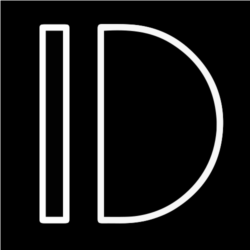
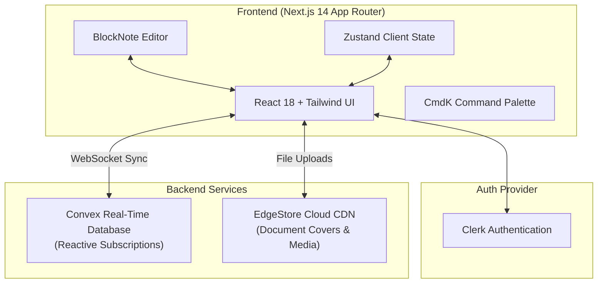

<div align="center">

  

  # 🌟 IDEASCRIBE
  
  **The Modern, Connected Workspace & Real-Time Note Canvas for Developers & Creators**

  [](https://github.com/Khangulamgousamjat)
  [](LICENSE)
  [](https://nextjs.org/)
  [](https://www.convex.dev/)
  [](https://www.typescriptlang.org/)
  [](https://tailwindcss.com/)

  <p align="center">
    <a href="#-about-the-project">About</a> •
    <a href="#-key-features">Features</a> •
    <a href="#%EF%B8%8F-tech-stack">Tech Stack</a> •
    <a href="#-system-architecture">Architecture</a> •
    <a href="#-getting-started">Getting Started</a> •
    <a href="#-project-structure">Directory</a> •
    <a href="#-creator--owner">Author</a> •
    <a href="#-license">License</a>
  </p>

</div>

---

## 📖 About The Project

**Ideascribe** is an all-in-one productivity suite and flexible canvas designed to bridge the gap between chaotic ideation and structured execution. Built from the ground up for modern developers, thinkers, and teams, Ideascribe combines the fluid block-editing elegance of Notion with instantaneous, reactive real-time cloud synchronization.

Whether you're drafting system architecture specs, organizing project sprints, or keeping personal notes, Ideascribe offers a lightning-fast, distraction-free writing environment with zero latency.

---

## ✨ Key Features

| Feature | Description |
| :--- | :--- |
| 📝 **Block-Based Rich Text** | Modular block editor powered by BlockNote with headings, checklists, syntax-highlighted code blocks, and media embeds. |
| ⚡ **Real-Time Reactive Sync** | Instant bidirectional synchronization powered by Convex WebSockets — never hit "Save" again. |
| 🌲 **Infinite Nested Canvas Tree** | Organize notes hierarchically with infinite child documents, drag-and-drop navigation, and collapsible sidebars. |
| 🔐 **Enterprise Authentication** | Frictionless, secure user sessions, OAuth logins, and user management via Clerk. |
| 🖼️ **Cover Images & Icons** | Customize every canvas with dynamic cover banners, custom emojis, and instant image uploads via EdgeStore CDN. |
| 🔍 **Universal Command Palette** | Fuzzy-search through all notes, recent canvases, and app shortcuts instantly with `Ctrl + K` / `Cmd + K`. |
| 🗑️ **Trash & Archive System** | Soft-delete safety net allowing quick document recovery or irreversible permanent removal. |
| 🌐 **One-Click Public Sharing** | Publish individual notes to a clean, read-only preview URL accessible to anyone without login. |
| 🌓 **Adaptive Dark & Light Mode** | Seamless, flicker-free themes with automatic OS preference detection. |
| 📱 **Responsive & Fluid UI** | Polished mobile and desktop experiences with collapsible sidebars and touch-friendly controls. |

---

## 🏗️ System Architecture



---

## 🛠️ Tech Stack

### Core Technologies
- **Framework:** [Next.js 14](https://nextjs.org/) (App Router & Server Components)
- **Language:** [TypeScript 5](https://www.typescriptlang.org/)
- **Styling:** [Tailwind CSS](https://tailwindcss.com/) with `tailwindcss-animate`
- **UI Primitives:** [Radix UI](https://www.radix-ui.com/) accessible components
- **Icons:** [Lucide React](https://lucide.dev/)

### Backend & Cloud Infrastructure
- **Real-Time Backend:** [Convex](https://www.convex.dev/) (Reactive NoSQL Database & Serverless Functions)
- **Authentication:** [Clerk](https://clerk.com/) (User Accounts, Social Logins & Session Tokens)
- **Object Storage:** [EdgeStore](https://edgestore.dev/) (Cloud Asset & Cover Management)
- **Editor Engine:** [BlockNote](https://www.blocknotejs.org/) (ProseMirror & TipTap-based Block Editor)

---

## 📂 Project Structure

```bash
ideascribe/
├── app/                          # Next.js 14 App Router
│   ├── (landingPage)/            # Public marketing landing page & footer
│   ├── (main)/                   # Authenticated workspace & canvas engine
│   │   ├── (routes)/canvas/      # Canvas document viewer & editor routes
│   │   └── _components/          # Navigation, sidebar, trash & banner controls
│   ├── (public)/                 # Public shareable preview routes
│   ├── api/edgestore/            # EdgeStore upload endpoints
│   ├── globals.css               # Global theme tokens & animations
│   └── layout.tsx                # Root layout, theme & provider wrappers
├── assets/                       # Custom dynamic message sets & prompts
├── components/                   # Shared UI component library
│   ├── modals/                   # Settings, confirm & cover image modals
│   ├── providers/                # Convex, Clerk, Theme & EdgeStore providers
│   ├── ui/                       # Radix UI primitives & styled components
│   ├── Editor.tsx                # BlockNote WYSIWYG editor component
│   └── OwnerBadge.tsx            # Animated owner attribution badge
├── convex/                       # Convex database schema & mutations
│   ├── canvas.ts                 # Canvas CRUD, archive & sharing functions
│   └── schema.ts                 # Document schema definitions
├── hook/                         # Custom React hooks (search, scroll, settings)
├── lib/                          # Utility functions & EdgeStore client
├── public/                       # Static SVGs, logos & favicons
└── tailwind.config.ts            # Custom design tokens & keyframes
```

---

## 🚀 Getting Started

Follow these instructions to set up the project locally on your machine.

### Prerequisites

- **Node.js**: `v18.17.0` or higher
- **npm**, **yarn**, or **pnpm**
- Accounts on:
  - [Convex](https://www.convex.dev/)
  - [Clerk](https://clerk.com/)
  - [EdgeStore](https://edgestore.dev/)


## ⌨️ Scripts Reference

| Command | Action |
| :--- | :--- |
| `npm run dev` | Runs the Next.js local development server with Turbopack / Fast Refresh |
| `npm run build` | Builds the production bundle |
| `npm run start` | Boots the Next.js production server |
| `npm run lint` | Runs ESLint to check for code quality and syntax issues |
| `npx convex dev` | Starts Convex local database sync and backend type generation |

---

## 👤 Creator & Owner

<div align="center">

  ### **GOUS KHAN**
  *Lead Architect, Owner & Full-Stack Developer*

  [](https://github.com/Khangulamgousamjat)
  [](https://github.com/Khangulamgousamjat/idescribe)

  *Crafted with precision, passion, and modern web architecture.*

</div>

---

## 📄 License

This project is open source and licensed under the **[MIT License](LICENSE)**.

Copyright &copy; 2026 **GOUS KHAN**. All rights reserved.

<div align="center">
  <sub>⭐ Found this project helpful? Consider giving it a star on GitHub! ⭐</sub>
</div>
